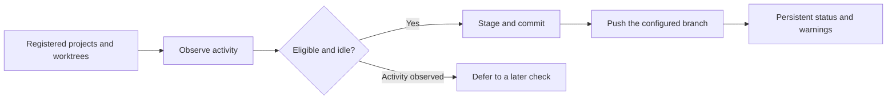

<div align="center">


# Paseo Overcommitted


[Features](#features) · [Getting started](#getting-started) · [Compatibility](#compatibility) · [Reference](docs/REFERENCE.md)

</div>

Keep idle Paseo projects and worktrees committed and pushed. Overcommitted checks registered repositories on a schedule, observes work in progress, and gives unpushed work a visible place in the app.

## Features

| Feature | What you get |
| --- | --- |
| Scheduled Git housekeeping | Configurable checks; default interval is 60 minutes |
| Activity-aware operations | Observed agent, script, terminal, and Linux process activity defers work |
| Branch routing | Optional protected-branch rules and interim branches |
| Persistent failures | Unpushed work stays visible across reloads and later checks |
| Preview mode | Inspect eligibility without staging, committing, or pushing |
| Local commit messages | Task titles, changed paths, and diff statistics; no model calls |

## How it fits



## Getting started

Requires Linux, Paseo 0.9.1, Git, npm, and plugins enabled. Your daemon must have normal Git author information and remote authentication.

```bash
git clone https://github.com/papag00se/paseo-overcommitted.git
cd paseo-overcommitted
npm ci --ignore-scripts --fetch-retries=0
npm run typecheck
paseo plugin install "$PWD"
```

Open **Settings → Plugins → Overcommitted → Settings**. Start with **Preview**, inspect the eligible repositories, then use **Check now** when you are ready. Automatic checks default on; the first scheduled check happens after one interval. Branch-name protection is an opt-in setting.


## Compatibility

Designed for Linux and Paseo 0.9.1. `/proc` provides process observations. The plugin never force-pushes, resets, stashes, or rebases. Git ignore rules apply; review what your repositories track before enabling automatic staging.

Activity checks are observations, not an atomic idle lease. Unknown activity information produces a warning and does not prevent a commit or push. The [reference](docs/REFERENCE.md) explains the ownership, retry, branch, and race-window contracts in detail.

## Development

```bash
npm run typecheck
npm test
```

Tests use temporary repositories and local bare remotes rather than your real remotes.

[Settings, activity checks, branch routing, retries, and failure visibility →](docs/REFERENCE.md)
