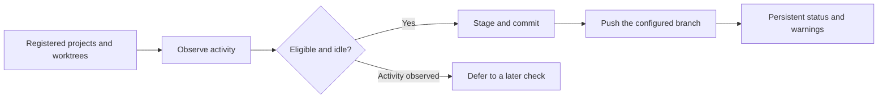
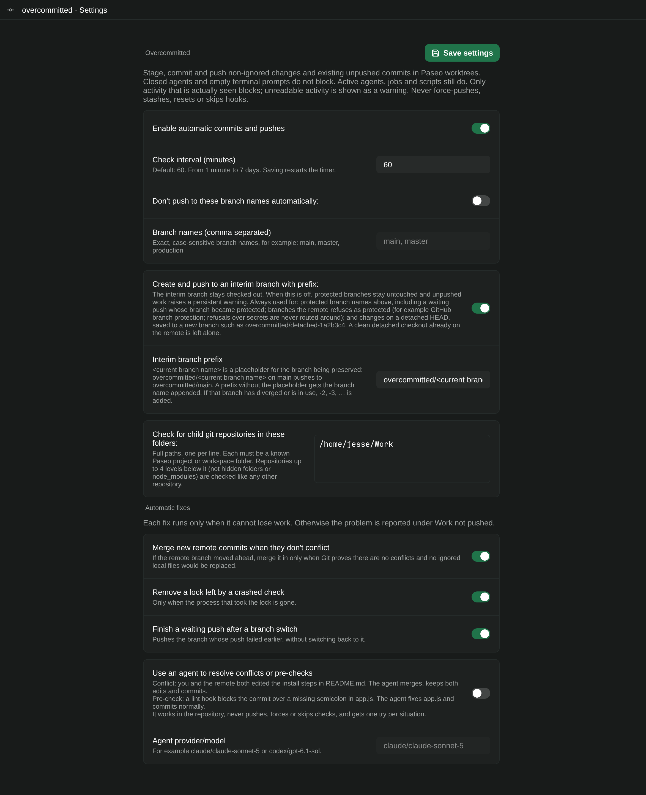

<div align="center">


# Paseo Overcommitted


[Features](#features) · [Getting started](#getting-started) · [Compatibility](#compatibility) · [Reference](docs/REFERENCE.md)

</div>

💾 Ever lost an afternoon of agent work because nobody committed it?

⏰ Overcommitted checks your Paseo projects and worktrees on a schedule, then commits and pushes anything left sitting there. 🛡️ It waits while an agent, script or terminal is busy. It can route protected branches like `main` to an interim branch instead. ⚠️ If something can't be pushed, it stays flagged in the sidebar until you deal with it.

## Features

| Feature | What you get |
| --- | --- |
| ⏰ Scheduled Git housekeeping | Checks every 60 minutes by default, from 1 minute to 7 days |
| 👀 Activity-aware | Busy agents, scripts, terminals and processes put a repo off until later |
| 🔀 Branch routing | Protect branches like `main` and push their work to `overcommitted/main` instead |
| 🗂️ Nested repos | Optionally sweeps Git repos inside a project folder |
| ⚠️ Persistent warnings | Unpushed work stays visible across reloads until it's resolved |
| 🔍 Preview mode | See what would happen without staging, committing or pushing |
| ✍️ Local commit messages | Built from task titles, changed paths and diff stats. No model calls |

## How it fits



## Getting started

Requires Linux, Paseo 0.9.1, Git, npm, and plugins enabled. Your daemon must have normal Git author information and remote authentication.

```bash
git clone https://github.com/papag00se/paseo-overcommitted.git
cd paseo-overcommitted
npm ci --ignore-scripts --fetch-retries=0
npm run typecheck
paseo plugin install "$PWD"
```

Open **Settings → Plugins → Overcommitted → Settings**. Start with **Preview**, inspect the eligible repositories, then use **Check now** when you are ready. Automatic checks default on; the first scheduled check happens after one interval. Branch-name protection is opt-in. In the interim prefix, `<current branch name>` is a placeholder for the protected branch's name: `overcommitted/<current branch name>` turns `main` into `overcommitted/main`. **Save settings** is at the top of the page. Leave settings with **← Back** or <kbd>Esc</kbd>.



## Compatibility

Designed for Linux and Paseo 0.9.1. `/proc` provides process observations. The plugin never force-pushes, resets, stashes, or rebases. If the remote branch has moved ahead, it merges those commits in only when Git proves the merge has no conflicts and replaces no ignored local files; otherwise it reports the problem and leaves everything as it was. Git ignore rules apply; review what your repositories track before enabling automatic staging.

Activity checks are observations, not an atomic idle lease. Unknown activity information produces a warning and does not prevent a commit or push. The [reference](docs/REFERENCE.md) explains the ownership, retry, branch, and race-window contracts in detail.

## Development

```bash
npm run typecheck
npm test
```

Tests use temporary repositories and local bare remotes rather than your real remotes.

[Settings, activity checks, branch routing, retries, and failure visibility →](docs/REFERENCE.md)
